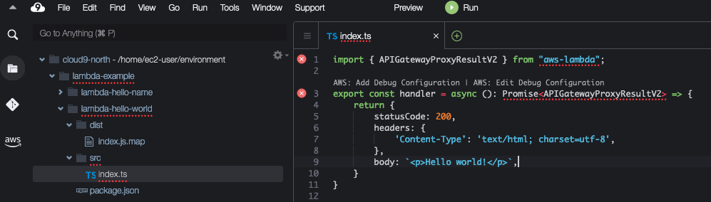
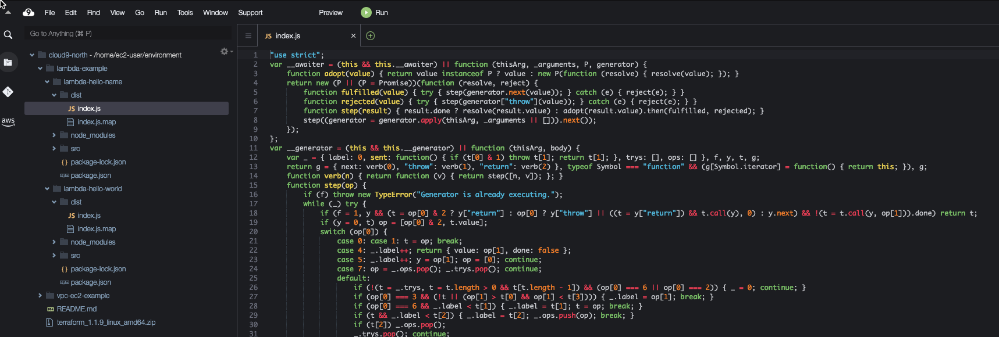
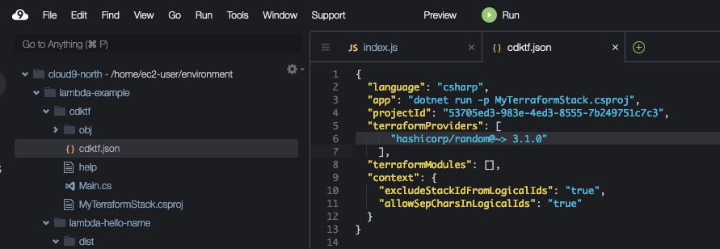

# Serverless with Lambda functions and API Gateway

In this tutorial, you will provision Lambda functions fronted by an API Gateway on AWS using the C# programming language.

## Initialize a new CDK for Terraform application

First make sure you are in the Cloud9 environment folder by running the the command line

```bash
cd ~/environment/
```

Start by creating a directory named lambda-example for your project

```bash
mkdir lambda-example
```

Then navigate into it.

```bash
cd lambda-example
```

Before we start creating our CDK for Terraform application, lets download the code for a couple of Lambda functions using the following commands

```bash
curl -L https://github.com/peerjako-aws/cdktf-csharp-examples/tarball/master > project.tar.gz
tar -xvf project.tar.gz  peerjako-aws*/lambda-example/lambda-hello-*
mv peerjako-aws*/lambda-example/lambda-hello* .
rm -rf peerjako-aws*
rm project.tar.gz
ls -la
```

You should now have a "lambda-hello-name" and a "lamdba-hello-world" directory. Our Lambda functions are written in TypeScript as you can see in for example lambda-example/lambda-hello-world/src/index.ts.



AWS Lambda do not understand TypeScript so we need to compile the two index.ts files into javascript. We will also save these .js files into dist folders. To do all that run the following commands

```bash
npm install typescript@latest -g   
cd ~/environment/lambda-example/lambda-hello-world
npm install
tsc src/index.ts --lib ES2015 --outDir dist
cd ~/environment/lambda-example/lambda-hello-name
npm install
tsc src/index.ts --lib ES2015 --outDir dist
cd ~/environment/lambda-example/

```

You should now have two index.js files, one in lambda-hello-world/dist and one in lambda-hello-name/dist



Now we have the code for our Lambda functions. Lets create a cdktf directory and navigate to it

```bash
mkdir cdktf; cd cdktf
```

Inside the cdktf directory, run the following command to initialize a cdktf project using the C# template and storing Terraform state locally

```
cdktf init --local --template csharp
```

If all went well you should see a "Your cdktf csharp project is ready!" message. Accept the defaults for "Project Name" and "Project Description".

## Install AWS provider

CDKTF provides packages with prebuilt classes for several common Terraform providers that you can use in your C# projects. For other Terraform providers and modules, you can add them to `cdktf.json` and use `cdktf get` to [generate the appropriate C# classes](https://www.terraform.io/cdktf/concepts/providers-and-resources#providers).

In this example we will be using the Terraform "random"-provider. Open the cdktf/cdktf.json file and add "hashicorp/random@~> 3.1.0" to the terraformProviders array like this



Now we want to Install the AWS provider. We also want to get that Terraform provider called "random", transpile it into a C# project and add a reference to that "random" C# project. Do that by running the following commands

```bash
dotnet add package HashiCorp.Cdktf.Providers.Aws
cdktf get
dotnet add reference .gen/random/random.csproj
dotnet restore

```


## Define your CDK for Terraform Application

In the Cloud9 explorer, navigate to the vpc-ec2-example/Main.cs file to view your application code. The template creates a scaffold with no functionality.


```c#
using System;
using Constructs;
using HashiCorp.Cdktf;

using System.Collections.Generic;
using HashiCorp.Cdktf.Providers.Aws;
using HashiCorp.Cdktf.Providers.Aws.S3;
using HashiCorp.Cdktf.Providers.Aws.Iam;
using HashiCorp.Cdktf.Providers.Aws.Lambdafunction;
using HashiCorp.Cdktf.Providers.Aws.Apigatewayv2;

namespace MyCompany.MyApp
{

    class LambdaFunctionProps
    {
        public string Path { get; set; }
        public string Handler { get; set; }
        public string RunTime { get; set; }
        public string StageName { get; set; }
        public string Version { get; set; }
    }

    class LambdaStack : TerraformStack
    {
        public LambdaStack(Construct scope, string id, LambdaFunctionProps config) : base(scope, id)
        {
            // define resources here
            new AwsProvider(this, "aws", new AwsProviderConfig{
                Region = "eu-west-1"
            });

            new random.RandomProvider(this, "random");

            random.Pet pet = new random.Pet(this, "random-name", new random.PetConfig {
                Length = 2
            });

            // Create a Terraform asset as zip archive from the path to the dist folder
            TerraformAsset asset = new TerraformAsset(this, "lambda-asset", new TerraformAssetConfig{
                Path = config.Path,
                Type = AssetType.ARCHIVE
            });

            // Create an S3 bucket to store our Lambda source code
            S3Bucket bucket = new S3Bucket(this, "bucket", new S3BucketConfig{
                BucketPrefix = "learn-cdktf-"
            });

            // Upload Lambda zip file to newly created S3 bucket
            S3Object lambdaArchive = new S3Object(this, "lambda-archive", new S3ObjectConfig{
                Bucket = bucket.Bucket,
                Key = config.Version + "/"+asset.FileName,
                Source = asset.Path
            });

            // Create Lambda role
            var lambdaRolePolicy = @"{
                ""Version"": ""2012-10-17"",
                ""Statement"": [
                    {
                    ""Action"": ""sts:AssumeRole"",
                    ""Principal"": {
                        ""Service"": ""lambda.amazonaws.com""
                    },
                    ""Effect"": ""Allow"",
                    ""Sid"": """"
                    }
                ]
            }";
        
            IamRole role = new IamRole(this, "lambda-exec", new IamRoleConfig{
                Name = "learn-cdktf-" + pet.Id,
                AssumeRolePolicy = lambdaRolePolicy
            });

            // Add an execution role for lambda to write to CloudWatch logs
            new IamRolePolicyAttachment(this, "lambda-managed-policy", new IamRolePolicyAttachmentConfig {
                PolicyArn = "arn:aws:iam::aws:policy/service-role/AWSLambdaBasicExecutionRole",
                Role = role.Name
            } );
    
            // Create a lambda function environment variable
            var lambdaFuncEnv = new LambdaFunctionEnvironment{
                Variables = new Dictionary<string, string>
                {
                    {"table", "dyndb123"}
                }
            };

            // Create Lambda function
            LambdaFunction lambdaFunc = new LambdaFunction(this, "learn-cdktf-lambda", new LambdaFunctionConfig{
                FunctionName = "learn-cdktf-" + pet.Id,
                S3Bucket = bucket.Bucket,
                S3Key = lambdaArchive.Key,
                Handler = config.Handler,
                Runtime = config.RunTime,
                Role = role.Arn,
                Environment = lambdaFuncEnv
            });

            // Create and configure API gateway
            Apigatewayv2Api api = new Apigatewayv2Api(this, "api-gw", new Apigatewayv2ApiConfig{
                Name = pet.Id,
                ProtocolType = "HTTP",
                Target = lambdaFunc.Arn
            });

            new LambdaPermission(this, "apigw-lambda", new LambdaPermissionConfig{
                FunctionName = lambdaFunc.FunctionName,
                Action = "lambda:InvokeFunction",
                Principal = "apigateway.amazonaws.com",
                SourceArn = api.ExecutionArn + "/*/*"
            });

            // Output the url for the API endpoint
            new TerraformOutput(this, "url", new TerraformOutputConfig{
                Value = api.ApiEndpoint
            });
        }

        public static void Main(string[] args)
        {
            App app = new App();
            new LambdaStack(app, "lambda-hello-world", new LambdaFunctionProps
                {
                    Path = "../lambda-hello-world/dist",
                    Handler = "index.handler",
                    RunTime = "nodejs14.x",
                    StageName = "hello-world",
                    Version = "v0.0.3"
                }
            ); 
            new LambdaStack(app, "lambda-hello-name", new LambdaFunctionProps
                {
                    Path = "../lambda-hello-name/dist",
                    Handler = "index.handler",
                    RunTime = "nodejs14.x",
                    StageName = "hello-name",
                    Version = "v0.0.1"
                }
            );

            app.Synth();
            Console.WriteLine("App synth complete");
        }
    }
}


```

