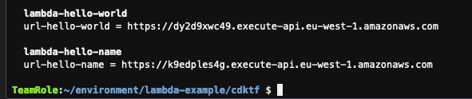
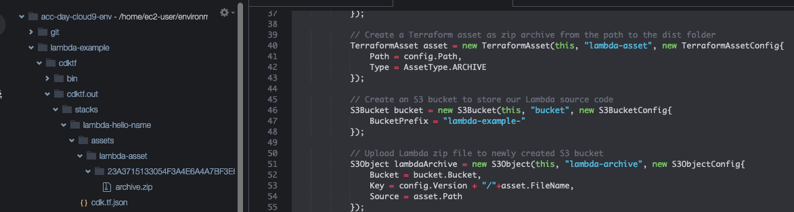

# Serverless with Lambda functions and API Gateway

In this tutorial, you will provision Lambda functions fronted by an API Gateway on AWS using the C# programming language.

## Initialize a new CDK for Terraform application

First make sure you are in the Cloud9 environment folder by running the the command line

```bash
cd ~/environment/
```

Start by creating a directory named lambda-example for your project

```bash
mkdir lambda-example
```

Then navigate into it.

```bash
cd lambda-example
```

Before we start creating our CDK for Terraform application, lets download the code for a couple of Lambda functions using the following commands

```bash
curl -L https://github.com/peerjako-aws/cdktf-csharp-examples/tarball/master > project.tar.gz
tar -xvf project.tar.gz  peerjako-aws*/lambda-example/lambda-hello-*
mv peerjako-aws*/lambda-example/lambda-hello* .
rm -rf peerjako-aws*
rm project.tar.gz
ls -la
```

You should now have a "lambda-hello-name" and a "lamdba-hello-world" directory. Our Lambda functions are written in TypeScript as you can see in for example lambda-example/lambda-hello-world/src/index.ts.


AWS Lambda do not understand TypeScript so we need to compile the two index.ts files into javascript. We will also save these .js files into dist folders. To do all that run the following commands

```bash
npm install typescript@latest -g   
cd ~/environment/lambda-example/lambda-hello-world
npm install
tsc src/index.ts --lib ES2015 --outDir dist
cd ~/environment/lambda-example/lambda-hello-name
npm install
tsc src/index.ts --lib ES2015 --outDir dist
cd ~/environment/lambda-example/

```

You should now have two index.js files, one in lambda-hello-world/dist and one in lambda-hello-name/dist


Now we have the code for our Lambda functions. Lets create a cdktf directory and navigate to it

```bash
mkdir cdktf; cd cdktf
```

Inside the cdktf directory, run the following command to initialize a cdktf project using the C# template and storing Terraform state locally

```
cdktf init --local --template csharp
```

If all went well you should see a "Your cdktf csharp project is ready!" message. Accept the defaults for "Project Name" and "Project Description".

## Install AWS provider

CDKTF provides packages with prebuilt classes for several common Terraform providers that you can use in your C# projects. For other Terraform providers and modules, you can add them to `cdktf.json` and use `cdktf get` to [generate the appropriate C# classes](https://www.terraform.io/cdktf/concepts/providers-and-resources#providers).

In this example we will be using the Terraform "random"-provider. Open the cdktf/cdktf.json file and add "hashicorp/random@~> 3.1.0" to the terraformProviders array like this


Now we want to Install the AWS provider. We also want to get that Terraform provider called "random", transpile it into a C# project and add a reference to that "random" C# project. Do that by running the following commands

```bash
dotnet add package HashiCorp.Cdktf.Providers.Aws
cdktf get
dotnet add reference .gen/random/random.csproj
dotnet restore

```


## Define your CDK for Terraform Application

In the Cloud9 explorer, navigate to the lambda-example/Main.cs file to view your application code. The template creates a scaffold with no functionality. Replace all the content in Main.cs with the follow code

```c#
using System;
using Constructs;
using HashiCorp.Cdktf;

using System.Collections.Generic;
using HashiCorp.Cdktf.Providers.Aws;
using HashiCorp.Cdktf.Providers.Aws.S3;
using HashiCorp.Cdktf.Providers.Aws.Iam;
using HashiCorp.Cdktf.Providers.Aws.Lambdafunction;
using HashiCorp.Cdktf.Providers.Aws.Apigatewayv2;

namespace MyCompany.MyApp
{

    class LambdaFunctionProps
    {
        public string Path { get; set; }
        public string Handler { get; set; }
        public string RunTime { get; set; }
        public string StageName { get; set; }
        public string Version { get; set; }
    }

    class LambdaStack : TerraformStack
    {
        public LambdaStack(Construct scope, string id, LambdaFunctionProps config) : base(scope, id)
        {
            // define resources here
            new AwsProvider(this, "aws", new AwsProviderConfig{
                Region = "eu-west-1"
            });

            new random.RandomProvider(this, "random");

            random.Pet pet = new random.Pet(this, "random-name", new random.PetConfig {
                Length = 2
            });

            // Create a Terraform asset as zip archive from the path to the dist folder
            TerraformAsset asset = new TerraformAsset(this, "lambda-asset", new TerraformAssetConfig{
                Path = config.Path,
                Type = AssetType.ARCHIVE
            });

            // Create an S3 bucket to store our Lambda source code
            S3Bucket bucket = new S3Bucket(this, "bucket", new S3BucketConfig{
                BucketPrefix = "learn-cdktf-"
            });

            // Upload Lambda zip file to newly created S3 bucket
            S3Object lambdaArchive = new S3Object(this, "lambda-archive", new S3ObjectConfig{
                Bucket = bucket.Bucket,
                Key = config.Version + "/"+asset.FileName,
                Source = asset.Path
            });

            // Create Lambda role
            var lambdaRolePolicy = @"{
                ""Version"": ""2012-10-17"",
                ""Statement"": [
                    {
                    ""Action"": ""sts:AssumeRole"",
                    ""Principal"": {
                        ""Service"": ""lambda.amazonaws.com""
                    },
                    ""Effect"": ""Allow"",
                    ""Sid"": """"
                    }
                ]
            }";
        
            IamRole role = new IamRole(this, "lambda-exec", new IamRoleConfig{
                Name = "learn-cdktf-" + pet.Id,
                AssumeRolePolicy = lambdaRolePolicy
            });

            // Add an execution role for lambda to write to CloudWatch logs
            new IamRolePolicyAttachment(this, "lambda-managed-policy", new IamRolePolicyAttachmentConfig {
                PolicyArn = "arn:aws:iam::aws:policy/service-role/AWSLambdaBasicExecutionRole",
                Role = role.Name
            } );
    
            // Create a lambda function environment variable
            var lambdaFuncEnv = new LambdaFunctionEnvironment{
                Variables = new Dictionary<string, string>
                {
                    {"table", "dyndb123"}
                }
            };

            // Create Lambda function
            LambdaFunction lambdaFunc = new LambdaFunction(this, "learn-cdktf-lambda", new LambdaFunctionConfig{
                FunctionName = "learn-cdktf-" + pet.Id,
                S3Bucket = bucket.Bucket,
                S3Key = lambdaArchive.Key,
                Handler = config.Handler,
                Runtime = config.RunTime,
                Role = role.Arn,
                Environment = lambdaFuncEnv
            });

            // Create and configure API gateway
            Apigatewayv2Api api = new Apigatewayv2Api(this, "api-gw", new Apigatewayv2ApiConfig{
                Name = pet.Id,
                ProtocolType = "HTTP",
                Target = lambdaFunc.Arn
            });

            new LambdaPermission(this, "apigw-lambda", new LambdaPermissionConfig{
                FunctionName = lambdaFunc.FunctionName,
                Action = "lambda:InvokeFunction",
                Principal = "apigateway.amazonaws.com",
                SourceArn = api.ExecutionArn + "/*/*"
            });

            // Output the url for the API endpoint
            new TerraformOutput(this, "url", new TerraformOutputConfig{
                Value = api.ApiEndpoint
            });
        }

        public static void Main(string[] args)
        {
            App app = new App();
            new LambdaStack(app, "lambda-hello-world", new LambdaFunctionProps
                {
                    Path = "../lambda-hello-world/dist",
                    Handler = "index.handler",
                    RunTime = "nodejs14.x",
                    StageName = "hello-world",
                    Version = "v0.0.3"
                }
            ); 
            new LambdaStack(app, "lambda-hello-name", new LambdaFunctionProps
                {
                    Path = "../lambda-hello-name/dist",
                    Handler = "index.handler",
                    RunTime = "nodejs14.x",
                    StageName = "hello-name",
                    Version = "v0.0.1"
                }
            );

            app.Synth();
            Console.WriteLine("App synth complete");
        }
    }
}


```

Lets start by having a look at the Main function. This time we actually have to stacks (LambdaStack). One uses the Lambda Function code for lambda-hello-world which just prints "Hello world!" the other one lambda-hello-name takes a URL parameter ?name=xyz and prints "Hello there xyz!". So using the sames stack code we can create multiple stacks with different configs (in this case two different code files).

Let us deploy both stacks. cdktf understands wild-cards so run the following command to deploy both the lambda-hello-world and lambda-hello-name stacks

```bash
cdktf deploy lambda*
```

cdktf also support Terraform Outputs. In this stack we output the API Gateway URL and since we have two stacks we get two outputs like this



Copy the hello world url into a browser and check that you get "Hello world!". Copy the hello name url and a add url parameter like ?name=this-is-my-name and open it in a browser. You should get "Hello world this-is-my-name!".

## Inspect the code used to create all the stack resources

Lets inspect the code of lambda-example/Main.cs to see what we actually created. First we created an AWS provider and then we used the Terraform random provider to create a pet object that has a random 2 word name. This 2-word name is what has been used to name a lot of the stack resources. So we can actually use multiple Terraform providers in the same stack. You could for example use the AWS provider to create an AWS EKS Kubernetes cluster and then use the Terraform Kubernetes provider to deploy applications to that cluster.

```c#
            new AwsProvider(this, "aws", new AwsProviderConfig{
                Region = "eu-west-1"
            });

            new random.RandomProvider(this, "random");

            random.Pet pet = new random.Pet(this, "random-name", new random.PetConfig {
                Length = 2
            });

```

Our Lambda function need some code. Instead of embedding the code directly into the Lambda Function resource we upload the code to an S3 bucket. We use the TerraformAsset resource to zip our Lambda code into an archive.zip file. We create an S3 bucket where we can put different versions of our Lambda code and we upload the local archive.zip file into that S3 bucket. Here you can see that local archive.zip file for the lambda-hello-name stack and the C# code making all this happen



Lambda functions needs IAM Roles that allows them to do various stuff. It could be to write their logs to CloudWatch logs, it could be acess to write to a DynamoDB database or maybe read-write to an S3 buckets. In our simple example we just want our Lambda function to be allowed to write to CloudWatch logs. The AWS managed "aws:policy/service-role/AWSLambdaBasicExecutionRole" policy allows for just that. 

Here you can see how we create an IAM Role that the Lambda function can assume and give it the AWSLambdaBasicExecutionRole policy.

```c#
           // Create Lambda role
            var lambdaRolePolicy = @"{
                ""Version"": ""2012-10-17"",
                ""Statement"": [
                    {
                    ""Action"": ""sts:AssumeRole"",
                    ""Principal"": {
                        ""Service"": ""lambda.amazonaws.com""
                    },
                    ""Effect"": ""Allow"",
                    ""Sid"": """"
                    }
                ]
            }";
        
            IamRole role = new IamRole(this, "lambda-exec", new IamRoleConfig{
                Name = "lambda-example-" + pet.Id,
                AssumeRolePolicy = lambdaRolePolicy
            });

            // Add an execution role for lambda to write to CloudWatch logs
            new IamRolePolicyAttachment(this, "lambda-managed-policy", new IamRolePolicyAttachmentConfig {
                PolicyArn = "arn:aws:iam::aws:policy/service-role/AWSLambdaBasicExecutionRole",
                Role = role.Name
            } );
    
```

Finally lets create the Lambda Function resource. We can also pass environment variables into the Lambda Function. Here is how this is done.

```c#
            // Create a lambda function environment variable
            var lambdaFuncEnv = new LambdaFunctionEnvironment{
                Variables = new Dictionary<string, string>
                {
                    {"table", "dyndb123"}
                }
            };

            // Create Lambda function
            LambdaFunction lambdaFunc = new LambdaFunction(this, "lambda-example-lambda", new LambdaFunctionConfig{
                FunctionName = "lambda-example-" + pet.Id,
                S3Bucket = bucket.Bucket,
                S3Key = lambdaArchive.Key,
                Handler = config.Handler,
                Runtime = config.RunTime,
                Role = role.Arn,
                Environment = lambdaFuncEnv
            });
```

Finally lets create an API Gateway and give it permission to invoke the Lambda Function. Lets also output the API Gateway URL using the Terraform output resource mechanism

```c#
            // Create and configure API gateway
            Apigatewayv2Api api = new Apigatewayv2Api(this, "api-gw", new Apigatewayv2ApiConfig{
                Name = pet.Id,
                ProtocolType = "HTTP",
                Target = lambdaFunc.Arn
            });

            new LambdaPermission(this, "apigw-lambda", new LambdaPermissionConfig{
                FunctionName = lambdaFunc.FunctionName,
                Action = "lambda:InvokeFunction",
                Principal = "apigateway.amazonaws.com",
                SourceArn = api.ExecutionArn + "/*/*"
            });

            // Output the url for the API endpoint
            new TerraformOutput(this, "url-" + config.StageName, new TerraformOutputConfig{
                Value = api.ApiEndpoint
            });
```

If you want to see the resources created in your AWS account then here are some links:

- [S3 buckets](https://s3.console.aws.amazon.com/s3/buckets)
- [Lambda Functions](https://console.aws.amazon.com/lambda/home#/functions)
- [API Gateways](https://console.aws.amazon.com/apigateway/main/apis)
- [IAM Role](https://console.aws.amazon.com/iamv2/home#/roles)

## Change the lambda-hello-name code

Now see if you can change the lambda-hello-name stack to use an environment variable as name input instead of the url query variable.

Some tips:

1. You need to change Main.cs to pass in a new environment variable to the Lambda function
2. You need to change the lambda-hello-name/src/index.ts code to use that enviroment variable and print out its value instead of the name query parameter
3. In TypeScript you can get an environment variable with code like this "process.env.myVariableName". Our Lambda function needs the @types/node package. You need to add that package to the package.json file. You need to run "npm i" to install the package in the node_modules folder.
4. You need to compile the typescript index.ts file into a javascript index.js file. E.g. like this "tsc ~/environment/lambda-example/lambda-hello-name/src/index.ts --lib ES2015 --outDir ~/environment/lambda-example/lambda-hello-name/dist"
5. Uploading a new archive.zip file with the new index.js code will not automatically trigger the Lambda Function to use this code. So you need to change the lambda-hello-name LambdaStack version parameters to a new version to trigger new code being used.

Thats it. If you have time left you could try to think of an AWS architecture you have worked on and implement it in a new cdktf application. You could also join one of the other groups to learn about some AWS services in detail and see how you deploy those using native AWS CDK.

