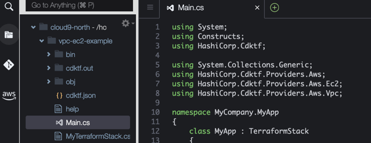
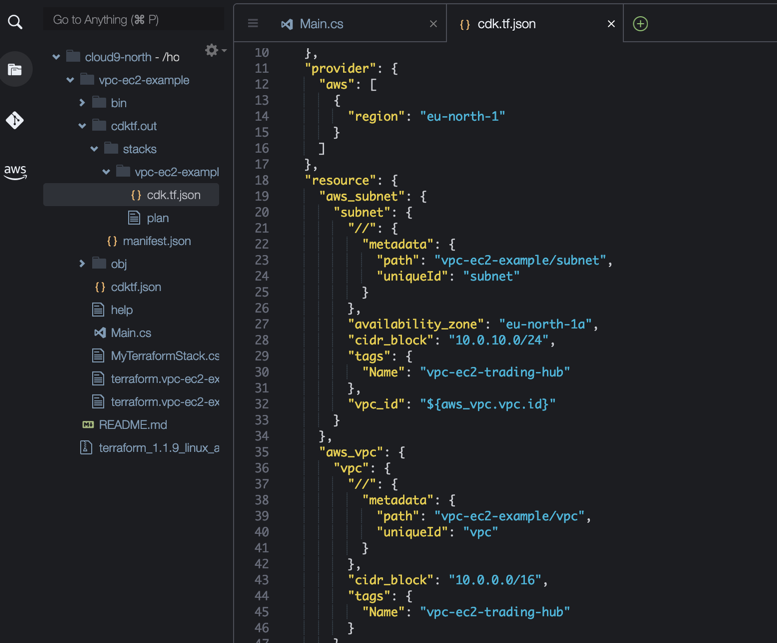
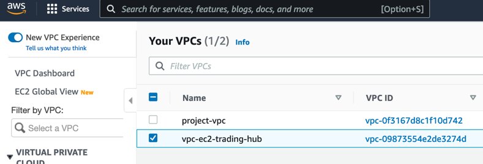
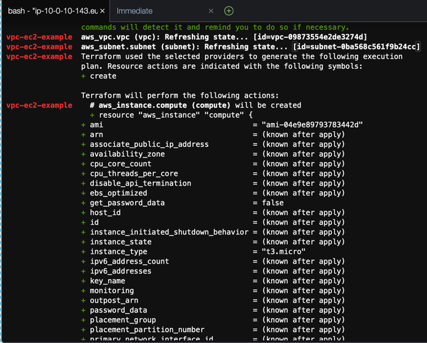

# VPC with EC2 instance Terraform for CDK example

The Cloud Development Kit for Terraform (CDKTF) allows you to define your infrastructure in a familiar programming language such as TypeScript, Python, Go, C#, or Java.

In this tutorial, you will provision an EC2 instance on AWS using the C# programming language.

## Initialize a new CDK for Terraform application

Start by creating a directory named vpc-ec2-example for your project

```bash
mkdir vpc-ec2-example
```

Then navigate into it.

```bash
cd vpc-ec2-example
```

Inside the directory, run the following command to initialize a cdktf project using the C# template and storing Terraform state locally

```
cdktf init --local --template csharp
```

If all went well you should see a "Your cdktf csharp project is ready!" message. Accept the defaults for "Project Name" and "Project Description".

## Install AWS provider

CDKTF provides packages with prebuilt classes for several common Terraform providers that you can use in your C# projects. For other Terraform providers and modules, you can add them to `cdktf.json` and use `cdktf get` to [generate the appropriate C# classes](https://www.terraform.io/cdktf/concepts/providers-and-resources#providers).

Install the AWS provider with the following dotnet command

```bash
dotnet add package HashiCorp.Cdktf.Providers.Aws
```

## Define your CDK for Terraform Application

In the Cloud9 explorer, navigate to the vpc-ec2-example/Main.cs file to view your application code. The template creates a scaffold with no functionality.

In this example we will be using vpc and ec2 resources. We will also need the System.Collections.Generic to use the Dictionary type for our resource tagging. Add the following using statements to Main.cs

```c#
using System.Collections.Generic;
using HashiCorp.Cdktf.Providers.Aws;
using HashiCorp.Cdktf.Providers.Aws.Ec2;
using HashiCorp.Cdktf.Providers.Aws.Vpc;
```

Your Main.cs file should now look like this.



Let us configure the AWS provider to use the eu-west-1 region by adding the following line to the MyApp stack part of Main.cs

```c#
new AwsProvider(this, "AWS", new AwsProviderConfig { Region = "eu-west-1" });
```

## Add a VPC with a private subnet

Lets start creating some infrastructure. First we will add a VPC with a CIDR block of "10.0.0.0/16". Add the following code just after the AwsProvider code-line

```c#
Vpc vpc = new Vpc(this, "vpc", new VpcConfig{
    CidrBlock = "10.0.0.0/16"
});
```

We also want a subnet in our VPC where we can deploy our EC2. Add the following code which creates a subnet with CIDR block of "10.0.10.0/24" in the eu-west-1a availability zone (chose another AZ if your region is not eu-west-1)

```c#
Subnet subnet = new Subnet(this, "subnet", new SubnetConfig{
  	VpcId = vpc.Id,
  	CidrBlock = "10.0.10.0/24",
  	AvailabilityZone = "eu-west-1a",
  	Tags = new Dictionary<string, string>{{"Name","vpc-ec2-trading-hub"}}
});

```

Lets see what kind of Terraform we get with the VPC and Subnet. Run the following terminal command

```bash
cdktf synth
```

The cdktf tool synthezises the stack into the file found at cdktf.out/vpc-ec2/example/cdk.tf.json . Navigate into that folder as shown on the image below. Open the file and inspect the content. You can see we have the AWS provider, the VPC and the Subnet.



Now we create the VPC and subnet in you AWS account using the cdktf deploy command. When asked to "Approve" hit enter and wait for the command to finnish

```bash
cdktf deploy
```

If you see "Apply complete! Resources: 2 added, 0 changed, 0 destroyed." then the resources were succesfully create. Go and check your new VPC called "vpc-ec2-trading-hub" in the [AWS console](https://console.aws.amazon.com/vpc/home#vpcs:).



## Add an EC2 instance using the latest Amazon Linux2 AMI

Now we want to create an EC2 instance in the private subnet with a specific IP. We want to use the latest Amazon Linux2 AMI in the region. CDK for Terraform supports the same Data concept as regular Terraform and we can therefore get the latest AMI by adding the following code:

```c#
DataAwsAmi latestAmazonLinux2Ami = new DataAwsAmi(this, "latest-ami", new 	DataAwsAmiConfig{
    MostRecent = true,
    Owners = new string[]{"amazon"},
    Filter = new DataAwsAmiFilter[]{
        new DataAwsAmiFilter{
            Name = "name",
            Values = new string[]{"amzn2-ami-hvm-*-x86_64-gp2"}
        }
    }
});
```

To find the latest ami we use MostRecent = true, the AMI Owner is amazon (this would be an AccountID like 099720109477 for Ubuntu or your own AWS AccountID if you published your own hardened AMIs). The filter "amzn2-ami-hvm-*-x86_64-gp2" finds the latest Amazon Linux2, with hmv (hardware virtual machine) on an x86_64 architecture using GP2 ssd disk.

Now we add the code that will create a network interface with a private subnet IP and we add the code to create the actual EC2 instance that uses this network interface.

```c#
NetworkInterface networkInterface = new NetworkInterface(this, "ec2-network-interface", new 	NetworkInterfaceConfig{
    SubnetId = subnet.Id,
    PrivateIp = "10.0.10.100",
    Tags = new Dictionary<string, string>{{"Name","vpc-ec2-trading-hub"}}
});
Instance instance = new Instance(this, "compute", new InstanceConfig
{ 
    Ami = latestAmazonLinux2Ami.Id,
    InstanceType = "t3.micro",
    NetworkInterface = new InstanceNetworkInterface[]{
        new InstanceNetworkInterface{
            DeviceIndex = 0,
            NetworkInterfaceId = networkInterface.Id
        }
    },
    Tags = new Dictionary<string, string>{{"Name","vpc-ec2-trading-hub"}}
});

```

Lets try to run the cdktf diff command to see what is the difference between what we have in our AWS account

```bash
cdktf diff
```

In the output you can see that there are no changes to the VPC and subnet but lots of additions to create the network interface and the EC2 instance.



Now deploy these two new resources using cdktf deploy (remember to hit enter when asked to Approve)

```bash
cdktf deploy
```

Once the stack is fully deployed you can see your new EC2 instance in the [AWS console here](https://console.aws.amazon.com/ec2/v2/home#Instances:instanceState=running).

## Additional tasks

You can either move to the [Serverless example](../lambda-example/README.md) to learn how to deploy Lambda functions fronted by an API GateWay or you can stay in this example and try to add a LoadBalancer, Security Groups and setup the EC2 instance to run user data that installs a webserver.

You can find the documentation for other AWS Provider resources here https://registry.terraform.io/providers/hashicorp/aws/latest/docs

If you want to delete all the resources created in the above example just run the following command

```bash
cdktf destroy
```

